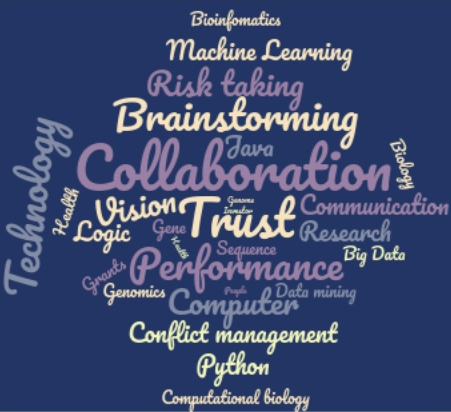

# BINF6399 - Principles of Team Science 

- Venue: 	University of North Carolina at Charlotte (UNCC)
- Date: 	Spring 2021
- Credits: 3 credit class
- Office hours: by appointment
- Meeting times: T/TH 4:00-5:15
- Where/Location: Main/Uptown Center Campus - Bioinformatics building 217
- Style of instruction: Hybrid: F2F & Online (Sync) Instructional Method 
- Department: Bioinfomatics and Genomics (BiG)

#### Instructors:	
- Dr. Richard Allen White III
- Email: rwhit101@uncc.edu

 

### Course Description
Introduction of appropriate project design, implementation, and management skills needed to function as a small team solving typical problems in Bioinformatics and Genomics. Students are given realistic problems and are required to develop specifications, deliverables, timelines, and costs. Under faculty supervision, the group assigns roles, responsibilities, and deadlines to complete the project and then execute the project. At the end of the course, the group produces a written document with deliverables and makes a formal presentation. See Syllabus in Docs folder for more details. 

### Bioinfomatic internship requirement waiver
Students who take BINF 6399 will not need to take BINF 6400 internship to satisfy degree requirements. 

#### Contact 
The point-of-contact for this project is [Dr. Richard Allen White III](https://github.com/raw-lab). 
If you have any questions or feedback, please feel free to get in touch by email.   
Dr. Richard Allen White III - rwhit101@uncc.edu.   
Or [open an issue](https://github.com/raw-lab/BINF6399/issues).
